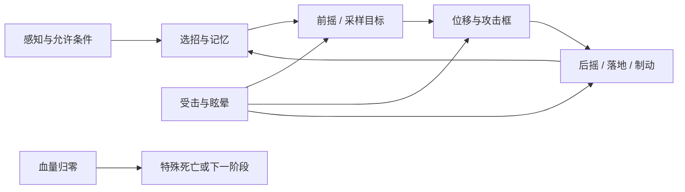

# 《丝之歌》战斗逻辑拆解与复现 · 学习阅读版

这份书的目标是让你看懂怪物为什么在此刻出这招，并能用简化图形重新做出同样的行为。读完某个案例后，你应该能回答：它怎么发现玩家、怎样选招、何时停止追踪、伤害框在哪一帧打开、玩家击中它后会打断什么，以及它怎样回到下一轮行动。

分析以你提供的 `/Users/mars/workspace/SilksongUnity6` 工程为准，完成日期为 2026-09-12。工程包含真实源码、场景内嵌的 PlayMaker 状态机、动画帧事件和物理配置。本文不是逐帧录像实测报告，也没有宣称已制作完成所有怪物的可玩复刻。我们能准确标明哪些是源数据，哪些是从数据算出的时间，哪些仍需运行验证。

## 怎么使用这份书

如果你已经会 Unity 的 Collider2D、Rigidbody2D 和最基本状态机，直接从三只小怪开始。若还分不清“动画结束”“状态结束”和“碰撞框关闭”，先读共享机制。随后学习三个 Boss，再用末尾的全量目录迁移到其他怪物。

推荐顺序：**苔骨飞虫 → 苔藓吐射者 → 骨族猎手 → 苔藓之母 → 蕾丝第一战 → Trobbio**。这些名称后的英文内部名是工程定位键，中文称呼只辅助阅读；查代码时以英文名、图鉴GUID和场景位置为准。

| 读到的内容 | 你应该做出的东西 | 验证方法 |
|---|---|---|
| 共享机制 | 能移动、接收伤害与死亡事件的空白敌人 | 一次命中、多框重叠、同帧互击、特殊死亡 |
| 苔骨飞虫 `MossBone Fly` | 警戒→追至上方→前摇→俯冲→撞地恢复 | 玩家横移、移到墙后、在不同阶段击中 |
| 吐射者 `Pilgrim Moss Spitter` | 保持位置/距离→前摇→发射→恢复 | 玩家越过头顶、进出射程、弹丸撞墙 |
| 骨族猎手 `Bone Hunter` | 近远决策与连击、位移、转向约束 | 在每个动画事件前后各走一步 |
| 苔藓之母 `Mossbone Mother` | 带血量门槛的招式变化 | 比较门槛之上、等于、之下 |
| 蕾丝 `Lace Boss1` | 高机动决斗与有记忆的出招 | 近、中、远距离重复输入并记录随机序列 |
| `Trobbio` | 技能表加阶段导演、场地攻击 | 主体退场后仍检查场地伤害与回合结束 |

本书的“全量”有明确分母：主图鉴的 **237 条记录**。我们扫描了 1,638 个场景和 Prefab，建立每条记录的对象/代码路线与一份完整规范样本数据。里面包括特殊互动或可收集生物，并非 237 个都拥有普通生命条。图鉴条目数也不等于 Boss 战次数：同一条目可以有多个战斗版本，多部位 Boss 可以有多个生命组件。

六个案例采用人工逐招解释；其余条目在全量目录中给出生命初值范围、行为状态入口、决策分支、运动/攻击状态以及可直接阅读的全量数据。规范样本之外的不同场景实例保留在 `data/catalog.json`，不能认为每个实例数值都相同。全量导出约 1.56 万状态、6.89 万动作；这些是**机器状态/动作数量，绝不是这么多种招式**。

官网的“超过200个敌人”只是总体描述，不是招式数据来源；所有数值来自本工程。[游戏官网](https://hollowknightsilksong.com/)。工程是否含有后续扩展与所有零售更新，不能仅靠文件名判断；官方曾公布将增加新区域、Boss等内容，因此本书不越过本地数据作保证。[官方扩展公告](https://www.teamcherry.com.au/blog/holiday2025)。

## 先学会把一招拆成七件事

“冲过来打我”不是足够复现的描述。把它拆成：

1. **允许发动**：是在攻击范围内、看到主角、处于地面，还是刚结束上一招？这些条件是同时满足，还是任一个成立？
2. **选择这招**：由固定顺序、距离分支还是随机选择决定？刚用过的技能会被抑制吗？某技能太久没用会被强制选中吗？
3. **前摇**：前摇期间敌人还能转向或跟随吗？动画事件、计时器和落地事件中谁决定结束？
4. **目标采样**：使用现在的玩家位置、进入前摇时的位置，还是每个物理步都更新？同样的冲刺速度，采样时刻不同就会有完全不同的躲避方式。
5. **攻击执行**：是直接设速度、逐步加速、设置位置、跳跃抛物线，还是生成独立弹丸？身体与武器是否分别造成伤害？
6. **后摇和中断**：动作结束后是立刻选下一招，还是先制动/落地/转身？被针击中只扣血，还是会打断？Boss 眩晕是否用另一台状态机？
7. **返回和记忆**：回到哪个决策点？冷却、连续次数、未使用次数是否更新？切阶段时这些记忆是否清除？

图中的受击箭头只表示“必须检查此处的处理”，不表示任何受击都能强制打断。原工程恰恰有很多受到伤害却继续出招的情况。

## 用可观察的因果关系理解战斗手感

玩家感觉到的“它在读我的输入”，经常是前摇仍更新目标或近身判定不断重评估；“它突然变快”，可能是动画结束事件恰好让两个状态在同一帧连续切换；“有时撞上去不掉血”，可能是攻击去重、玩家无敌、弹反先结算或碰撞框关闭。不能只看画面就给它们起一个心理化的名字。

复现时先画矩形，给感知范围、身体碰撞、受击框、每个攻击框用不同颜色。屏幕角落实时显示 FSM 当前状态、动画帧号、速度、HP与随机抽样序号。第一次能看见“第7帧切到攻击框B”比第一次换上原版贴图更有学习价值。

时间尤其要分开：该工程物理步约 50Hz；动画可能是24fps、16fps等；画面渲染又可能是60fps或120fps。**第7个动画帧不是第7个游戏物理步。** 静态帧事件时间可以用 `帧号 / clip.fps` 计算，但实际触发还受首帧事件策略、跨帧、速度和时间缩放影响；后文会说明哪些数字是这样推导的。

## 这次学习的完成标准

做到下列四层才算有依据地复现：

| 层级 | 合格表现 | 不足以通过的现象 |
|---|---|---|
| 状态结构 | 同样输入触发同样状态和事件路径 | 看起来会巡逻和攻击 |
| 时间与空间 | 前后摇、追踪公式、转向和范围与数据相符 | 凭感觉调得差不多 |
| 战斗判定 | 命中帧、去重、打断、眩晕和死亡分支正确 | 只要碰上就扣血 |
| 场景闭环 | 多阶段、召唤、退场、门、重置一致 | 血条清空后删掉Boss |

自建实验建议先固定武器伤害和玩家碰撞尺寸，禁用复杂装备，以便解释每次HP变化。等最小闭环通过后再加入工具、毒电标记和难度变体。这是学习实验的组织方式，不是对原游戏规则的删改结论。
